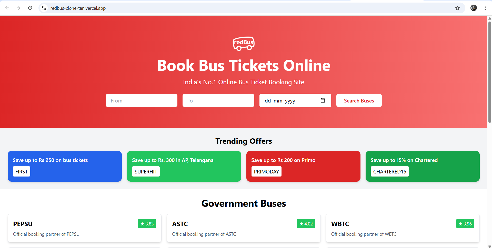

# 🚌 redBus Frontend Clone

A fully responsive frontend clone of the redBus homepage, built using **React**, **Tailwind CSS**, and **Vite**. This clone focuses on recreating the modern UI and UX of the original redBus website, starting with the Hero section and trending offers.

### 🔗 Live Demo
[Click here to view the live site](https://redbus-clone.vercel.app)

---

## 🚀 Tech Stack

- **React.js** – JavaScript library for building UI
- **Tailwind CSS** – Utility-first CSS framework
- **Vite** – Frontend build tool
- **Vercel** – For deployment

---

## 📸 Preview

---

## 📂 Folder Structure

